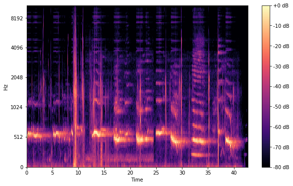

# SpectroTune---Genre-Classifier

## Introduction
Music genre classification is an essential aspect of music information retrieval (MIR) and has numerous applications in the music industry, ranging from content-based music recommendation to indexing and organizing music databases. With the rise in digital music streaming platforms, such as Spotify, the ability to classify songs into genres automatically becomes increasingly significant.

## The Problem
The primary challenge in music genre classification is to extract meaningful features from audio tracks and employ them to categorize tracks into respective genres. The task is further complicated by the subtle distinctions between some music genres, overlaps in musical elements across genres, and the dynamic nature of music genres over time.

## Data Available
There are 2 sources of data:
- [GTZAN Dataset - Music Genre Classification](https://www.kaggle.com/datasets/andradaolteanu/gtzan-dataset-music-genre-classification?select=Data)
- [Spotify 3-Second Mel Spectrograms](https://www.kaggle.com/datasets/mrodriguez2/spotify-3-second-mel-spectrograms)

## How  To Use
- Create a folder called `Data/genres_original` with the unzipped GTZAN file
- Run `audio_noise_adder_async.py` to add noise to the .wav files and save it
- Run `image_gen_async.py` to use the noisy .wav files and generate spectrograms
- Run relevant script for different ML approachs to genre classification

## References
- [Creating a Music Genre Classifier using a Convolutional Neural Network](https://glenn-viroux.medium.com/creating-a-music-genre-classifier-using-a-convolutional-neural-network-548d06658cee)
- [Music Genre Classification using Deep Learning (Audio and Video)](https://medium.com/@aritrachowdhury95/music-genre-classification-using-deep-learning-audio-and-video-770173980104)
- [CS229 Final Report - Music Genre Classification](https://www.scribd.com/document/527508484/music-5)
- [Tzanetakis, G., & Cook, P. (2002). Musical genre classification of audio signals. IEEE Transactions on Speech and Audio Processing, 10(5), 293-302.](https://ieeexplore-ieee-org.ezproxy.lib.utexas.edu/stamp/stamp.jsp?tp=&arnumber=1021072)
- [Choi, K., Fazekas, G., & Sandler, M. (2017). Automatic tagging using deep convolutional neural networks. In "ISMIR" (pp. 805-811).](https://arxiv.org/pdf/1606.00298.pdf)
- [Dieleman, S., & Schrauwen, B. (2014). End-to-end learning for music audio. In "ICASSP, IEEE" (pp. 6964-6968).](https://arxiv.org/pdf/2105.11836.pdf)